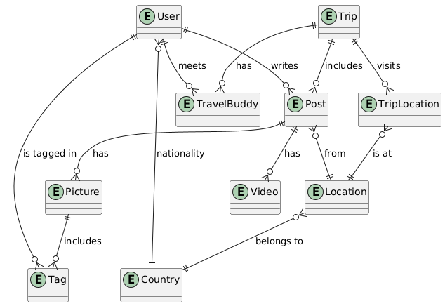
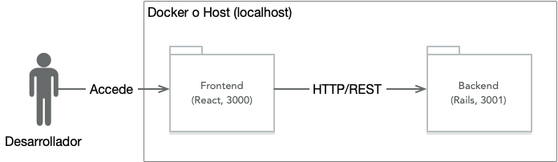

# Proyecto de Aplicaciones Móviles - Enunciado General del Proyecto

Durante este semestre, el proyecto del curso consistirá en el desarrollo de una aplicación móvil orientada a la creación de una bitácora de viajes. La aplicación permitirá a cada usuario generar viajes que incluyan múltiples destinos, y registrar en ellos notas o publicaciones (posts) asociadas a las distintas ubicaciones visitadas. Estas publicaciones podrán contener texto, imágenes y vídeos.

Adicionalmente, los usuarios podrán gestionar una lista de travel buddies (amigos de viaje), incorporando a sus amistades durante el desarrollo de cada viaje. Las publicaciones podrán ser compartidas con estos compañeros, incluyendo funcionalidades como menciones y etiquetas (_tagging_) en fotografías u otros contenidos.

Cada grupo deberá definir un nombre para su aplicación, el cual ciertamente deberá respetar la moral y las buenas costumbres.

## Entrega 1

Los requisitos de la primera entrega del proyecto están en el directorio `docs/entrega-1.1/enunciado.md` ([pinchar aquí](docs/entrega-1.1/enunciado.md)). Para las entregas siguientes, los enunciados se agregarán bajo el directorio `docs`. 

Para actualizar el código base del proyecto de acuerdo a los anuncios de los profesores (p.ej., para obtener el enunciado de la segunda entrega y siguientes), deben configurar un origen remoto "upstream" en su repositorio. Vean la sección "Uso del repositorio" más abajo en este mismo documento.

## Modelo de Dominio

El modelo de dominio de la aplicación que vamos a desarrollar tiene varias entidades y relaciones relevantes:

1. Usuario (`User`): Un usuario registrado en la aplicación. Puede crear viajes, publicaciones y tener amigos de viaje (_travel buddies_). Se registra su nombre y apellido, sobrenombre ("_handle_" único a la usanza de las redes sociales), y su nacionalidad (`Country`).
2. País (`Country`): Un país del mundo. Asociado tanto a `Locations` como a la nacionalidad de los `Users`.
3. Viaje (`Trip`): Un viaje creado por un `User`. Está compuesto por una serie de ubicaciones (`Locations`) visitadas por el usuario, en un determinado orden temporal.
4. Ubicación (`Location`): Un lugar geográfico (por ejemplo, ciudad o punto específico) que forma parte de un `Trip`. Está asociada a un `Country`.
5. Post (`Post`): Una publicación realizada por un `User` en una `Location` durante un `Trip`. Puede contener texto y/o archivos multimedia.
6. Imagen del `Post` (`Picture`): Una imagen asociada a un `Post`, que puede incluir etiquetas a otros `Users` (ver `Tag`).
7. Video del `Post` (Video): Un video asociado a un `Post`.
8. Etiqueta (`Tag`): Representa la mención o identificación de un `User` en una `Picture`. Une un `Picture` con un `User`.
9. Compañero de Viaje (`TravelBuddy`): Representa la participación de un `User` como acompañante en un `Trip` de otro `User`.

Relaciones:

Relaciones:

1. Un Usuario tiene una nacionalidad (`User` -- `Country`)
   - Un Usuario puede estar asociado a un País como nacionalidad.
2. Un Usuario crea muchos Viajes (`User` -- `Trip`)
   - Un Usuario puede haber creado varios Viajes.
3. Un Viaje tiene muchos Compañeros de Viaje (`Trip` -- `TravelBuddy` -- `User`)
   - Un Viaje puede incluir a varios Usuarios como travel buddies.
4. Un Usuario puede ser travel buddy en muchos Viajes (`User` -- `TravelBuddy` -- `Trip`)
   - Un Usuario puede haber sido invitado a múltiples viajes como compañero.
5. Un Viaje recorre varias Ubicaciones (`Trip` -- `TripLocation` -- `Location`)
   - Un Viaje pasa por varias Ubicaciones, en un cierto orden.
6. Una Ubicación pertenece a un País (`Location` -- `Country`)
   - Cada Ubicación está situada en un País específico.
7. Un Usuario crea muchas Publicaciones (`User` -- `Post`)
   - Un Usuario puede crear muchos Posts durante sus viajes.
8. Un Post pertenece a un Viaje y a una Ubicación (`Post` -- `Trip`, `Post` -- `Location`)
   - Cada Post se asocia a un Viaje y a una Ubicación visitada.
9. Un Post puede tener muchas Imágenes (`Post` -- `Picture`)
   - Un Post puede incluir varias imágenes.
10. Un Post puede tener muchos Videos (`Post` -- `Video`)
    - Un Post puede incluir uno o más videos.
11. Una Imagen puede tener muchas Etiquetas (`Picture` -- `Tag`)
    - En una Imagen se pueden etiquetar a varios Usuarios.
12. Una Etiqueta conecta una Imagen con un Usuario (`Tag` -- `User`)
    - Una Etiqueta representa que un Usuario ha sido mencionado o etiquetado en una Imagen.
13. Un Usuario puede estar etiquetado en muchas Imágenes (`User` -- `Tag` -- `Picture`)
    - Un Usuario puede aparecer etiquetado en múltiples imágenes.



## Arquitectura del Proyecto Base

El proyecto base está conformado por una aplicación de backend (en directorio `backend`), desarrollada en Rails 8, y otra aplicación de frontend escrita en React, generada con la herramienta Vite (en directorio `frontend`).

La aplicación Rails de backend ha sido generada en modo API, es decir, no tiene componentes de ActionView para renderizado de HTML. Esta aplicación contiene prácticamente todos los modelos necesarios, con validaciones relevantes y asociaciones. Las tablas tienen índices.

ActiveStorage viene pre-configurado en la aplicación de backend y algunos de los modelos como `User`, `Trip` y `Location` permiten adjuntar fotografías.

Devise y Devise-JWT también vienen pre-configurados y es posible usar la API del backend autenticando con tokens del tipo JavaScript Web Tokens (JWT), encapsulados en cookies tipo http-only.

La aplicación además tiene tests escritos con RSpec para la mayor parte de los modelos, y algunos controladores.

No todas las rutas están especificadas en la aplicación, ni todos los controladores están creados. Completar esto será trabajo de los grupos de proyecto.

La aplicación de frontend, creada con Vite, está en un nivel muy básico y será su trabajo completarla en el proyecto del curso.

En el despliegue de desarrollo, la aplicación Rails (API) está configurada para operar en el puerto 3001, y la aplicación de frontend en el 3000.

El esquema arquitectónico a ojos del desarrollador que trabaja en su máquina local es el siguiente:



## Requisitos Funcionales

Los requisitos funcionales de la aplicación que deberán desarrollar son los siguientes:

1. Los usuarios (ver modelo `User` y tabla correspondiente) pueden registrarse ingresando nombre, correo electrónico, un *handle* (similar a X o Instagram, p. ej., `@nomadclimber`), y su nacionalidad (ver modelo `Country`).
2. Los usuarios pueden crear nuevos viajes (`Trip`), dándoles un título y descripción, además de una fecha de inicio y término opcional.
3. Los usuarios pueden buscar ubicaciones (`Location`) por nombre o seleccionarlas desde un mapa interactivo, y agregarlas a algún viaje en el orden en que las visitarán.
4. Los usuarios pueden hacer *check-in* en una `Location` de un `Trip` en curso, registrando la fecha de la visita. Esto crea una entrada en `TripLocation`.
5. Desde una `Location` donde han hecho *check-in*, los usuarios pueden crear publicaciones (`Post`) que incluyan texto, imágenes (`Picture`) y/o vídeos (`Video`).
6. Los usuarios pueden ver la cronología de publicaciones de un viaje, ordenadas por fecha y agrupadas por ubicación visitada.
7. Los usuarios pueden buscar a otros usuarios por *handle* y agregarlos como *travel buddies* (`TravelBuddy`), registrando la `Location` y la fecha en que se conocieron.
8. Los usuarios pueden invitar a sus *travel buddies* a un viaje específico (`TravelBuddy`), permitiéndoles contribuir con sus propias publicaciones.
9. Los usuarios pueden etiquetar (`Tag`) a sus *travel buddies* en las imágenes y vídeos de sus publicaciones.
10. Los usuarios pueden ver las publicaciones de un `Trip` como una galería multimedia, incluyendo las etiquetas y menciones a otros usuarios.
11. Los usuarios pueden ver en un mapa el recorrido de un viaje, visualizando las `Locations` visitadas y los contenidos publicados en cada una.
12. Los usuarios pueden acceder al perfil de otros usuarios, visualizar sus viajes públicos y sus publicaciones compartidas.

En las entregas sucesivas del proyecto se les irá solicitando completar funcionalidad relativa a los requisitos anteriores, y se les dará más detalle sobre las funciones específicas a implementar.

## Iniciar la Aplicación

Si se opta por trabajar en el sistema operativo host en ambiente de desarrollo, instalando RVM y Node (ver sección de Herramientas Requeridas más adelante), entonces se debe iniciar la aplicación Rails con el backend, y el servidor web de Vite que sirve la aplicación React.

Antes de ejecutar la aplicación Rails por primera vez, es necesario crear una clave para los tokens de autenticación que son generados por el backend.

**Preparar clave para tokens de autenticación JWT generados por el backend Rails**

Para iniciar la aplicación Rails por primera vez, ir al directorio `backend` en la consola y ejecutar los siguientes pasos:

```sh
bundle install # verificar que las gemas queden instaladas correctamente
```
Luego, se debe crear un archivo de configuración encriptado para Rails, incluyendo la clave para los tokens JWT utilizados por devise-jwt. Para esto, asegurarse primero de eliminar archivos `config/credentials/*.yml.enc` si es que el repositorio los contiene.

```sh
rm config/*.yml.enc
```

Luego, se necesita crear una clave para que devise-jwt y Warden generen tokens JWT válidos:

```sh
rails runner "require 'securerandom'; puts SecureRandom.hex(64)"
```

Copiar la clave generada en la consola.

```sh
EDITOR="nano" rails credentials:edit --environment test
```

Al final del archivo agregar una línea con el siguiente contenido:

```
devise_jwt_secret_key: [clave generada por comando anterior sin estos corchetes]
```

Guardar el archivo y salir. Repetir cambiando la opción `--environment test` por `--environment development`. Si se va a realizar una instalación de producción, se debe también realizar este paso con el ambiente `production`.

**Ejecutar las migraciones**

Se debe ejecutar las migraciones y verificar que no haya errores.

```sh
rails db:migrate
```

**Ejecutar tests del backend Rails**

Luego, es posible ejecutar los tests:

```sh
bundle exec rspec # verificar que los tests pasen
```

**Iniciar la aplicación de backend Rails**

```sh
rails s # iniciar la aplicación
```

Las siguientes ejecuciones de la aplicación sólo requieren levantar el sevidor Puma con el comando `rails s`.

**Iniciar la aplicación de frontend con Vite**

Luego, para iniciar la aplicación React con Vite, se debe ir al directorio `www-frontend` en el repositorio y allí ejecutar:

```sh
npm install -g yarn
yarn install
yarn dev
```

Se puede detener la aplicación con Ctrl+C. Basta `yarn dev` para volver a ejecutar.

**Inicio de la aplicación con Docker**

En el directorio raíz de la aplicación hay un archivo de configuración `docker-compose.yml` preonfigurado para hacer funcionar las aplicaciones de `frontend` y `backend` en ambiente de desarrollo. Los sistemas de archivo de los contenedores quedan mapeados al sistema de archivos del host para acceder al código. Por esto, es importante realizar los pasos de generación de clave para token JWT en la aplicación Rails como se explica arriba antes de ejecutar con Docker.

Con Docker Compose, se instalarán automáticamente todas las imágenes necesarias. Ejecutar el siguiente comando:

```sh
docker-compose up
```

Se pueden detener las aplicaciones con `Ctrl+C`. Así queda compose utilizando el terminal actual para mostrar la salida de los contenedores. También se puede desacoplar del terminal:

```sh
docker-compose up -d
```

En este modo desacoplado se pueden inspeccionar los logs con:

```sh
docker logs -f
```

Para detener las aplicaciones

```sh
docker-compose down
```

Si tienes aplicaciones docker compose concurrentes (p.ej., en otros cursos), es una buena idea usar proyectos para rotular las imágenes y que no haya choques entre proyectos distintos:

```sh
docker-compose up -p appsmoviles -d
```

En este último caso, para detener la aplicación se puede usar el mismo comando de arriba (down). Se puede pasar el nombre del proyecto por variable de entorno:

```sh
COMPOSE_PROJECT_NAME=appsmoviles docker-compose down
```

Finalmente, hay situaciones en las que quedan contenedores huérfanos, por ejemplo, cuando hay caídas de contenedores. La forma de detener y eliminar contenedores huérfanos es a través del comando:

```sh
docker-compose down --remove-orphans
```

## Probar la API desde un cliente web

Es recomendable usar Postman para realizar pruebas de la API antes de implementar funcionalidad en el frontend. Para esto, considerar que:

* Hay una pequeña colección públicamente compartida de llamadas a la API, para Postman, que ha creado el profesor del curso, disponible en [https://bit.ly/icc4203-202420-project-postman-collection](https://bit.ly/icc4203-202420-project-postman-collection).
* Antes de llamar a las operaciones de la API, es necesario autenticarse con el sistema backend. Para esto se debe ejecutar la petición `POST http://localhost:3001/api/v1/signup` para crear una cuenta. Ver los detalles del usuario a crear en la pestaña "Body".
* Luego es necesario obtener un token JWT llamando a `POST http://localhost:3001/api/v1/login`, con el usuario y la clave utilizada en la petición anterior.
* Ver el token JWT en la respuesta de la llamada anterior. Copiarlo.
* Luego, es posible llamar a cualquier operación de la API usando el token JWT. Por ejemplo, ir a `POST http://localhost:3001/api/v1/trips`, y con esa solicitud crear un nuevo viaje. Es necesario agregar un header (ir a pestaña Headers), con key "Authorization", y con el token JWT en valor (value). Se tiene que leer en value "Bearer [token JWT]".
* Es responsabilidad del cliente eliminar el token JWT cuando se deja de usar. Los tokens tienen vigencia de 24 hrs. una vez creados. Esto se ajusta en `backend/config/initializers/devise.rb` en `jwt.expiration_time`.

## Uso del repositorio

Cada grupo de proyecto obtiene su repositorio a través de una invitación de GitHub Classroom. Los grupos podrán crear libremente ramas locales y remotas para avanzar en el desarrollo de su aplicación. Sin embargo,

* Se considerará que la rama main contiene el último código estable que será revisado y evaluado por el ayudante.
* Pueden usar issues de GitHub en su repositorio para mantener registro de bugs, o features que requieran implementar.
* Para las entregas, antes de la fecha límite, deben crear un _pull request_ e incluir al ayudante de proyecto que tengan asignado. El _pull request_ puede ser creado sin requerir una mezcla de código. Más bien, su fin es que el ayudante pueda revisar el código y dejar su evaluación de cada aspecto en la entrega. El título del pull request debe decir "Revisión Entrega X", en donde X es el número de la entrega. La primera parte del proyecto (frontend web) tendrá números 1.1 a 1.5, y la segunda parte números 2.1 a 2.3.

Los profesores del grupo continuarán trabajando sobre el repositorio con el código base durante el semestre, para tanto para remediar posibles bugs como para proveer nuevas funciones relevantes para alguna de las entregas. Esto incluirá el código base para la segunda parte del proyecto en donde la aplicación de frontend será del tipo híbrido.

Para que los grupos puedan actualizar su repositorio con nuevos lanzamientos de código base, deben ejecutar los siguientes comandos su su repositorio local:

```sh
git remote add upstream https://github.com/icc4203-202520/project-base
```

Este comando permite agregar el repositorio de código base mantenido por los profesores del curso como otro origen remoto, de nombre "upstream". Luego, para aplicar los cambios que se encuentren en dicho repositorio en el repositorio local, se deben ejecutar los siguientes comandos:

```sh
git fetch upstream
git merge upstream/main --allow-unrelated-histories
```

## Herramientas Requeridas para el desarrollo

Para desarrollar este proyecto, se requiere un entorno de programación que cuente con:

* Ruby Version Manager (RVM), capaz de ejecutar lenguaje Ruby 3.4.5, disponible en https://rvm.io. La instalación de ruby con rvm es bastante simple:
```sh
rvm install 3.4.5
```
La aplicación rails en el directorio `backend` cuenta con archivos `.ruby-version` y `.ruby-gemset` que permiten cambiar automáticamente a la versión y gemset correcta.
* Para desarrollo de frontend, se requiere Node 24, instalable en [Mac con homebrew](https://formulae.brew.sh/formula/node@24), o en Linux, como sistema operativo host, en una máquina virtual, con Windows Subsystem for Linux (WSL), o con Docker. Se puede usar Node Version Manager (nvm, similar a rvm para ruby) y así mantener distintas versiones de node en el host. Toda la información sobre cómo instalar y usar nvm está disponible en [su sitio en Github](https://github.com/nvm-sh/nvm).
* Recomendamos VSCode como IDE.
* Postman para realizar pruebas contra la API.
* Figma para prototipado de la interfaz de usuario (más indicaciones sobre esto en el enunciado 1.1 del proyecto).
* Docker no es estrictamente requerido, pero puede facilitar la instalación del ambiente de desarrollo, dado que el proyecto incluye archivo `docker-compose` y archivos `Dockerfile`. Así no se requeriría instalar todas las herramientas nombradas arriba, a excepción de VSCode.

Pueden usar la máquina virtual basada en Debian 12 que se encuentra disponible para descarga en el sitio del curso en Canvas, o bien, ustedes mismos instalar el software nombrado arriba.
