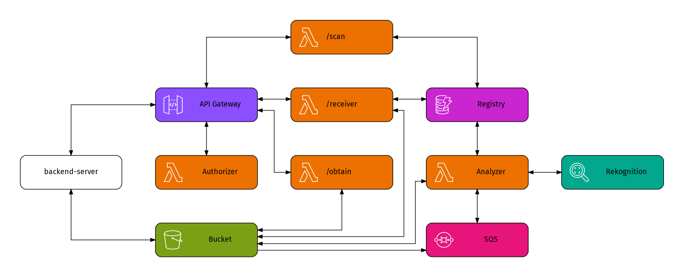

# Entrega 2.2 - Sistema de procesamiento de imágenes serverless para producción

## Objetivos

El objetivo de la entrega 2.2 consiste en materializar la prueba de concepto desarrollada en la entrega 2.1, implementando un sistema completo de procesamiento serverless de imágenes que se integre robustamente con la aplicación TravelLog existente. Esta entrega incluye autenticación JWT, optimización de transferencia de archivos, y endpoints adicionales para consulta de datos.

## Descripción del Sistema

En esta entrega se desarrollará la versión de producción del sistema distribuido que procese automáticamente las imágenes subidas por los usuarios a la plataforma TravelLog. El sistema debe funcionar de forma paralela al flujo actual de la aplicación, pero con mejoras significativas en términos de seguridad, escalabilidad y funcionalidad.

Se continuará con la denominación del actual despliegue como **backend-server** y al sistema de procesamiento automático como **backend-serverless**.

### Arquitectura del Sistema

El diagrama a continuación ilustra la arquitectura general del sistema backend-serverless y su integración con el backend-server existente:



El sistema backend-serverless estará compuesto por los siguientes componentes de AWS:

1. **API Gateway**: Punto de entrada único para todas las operaciones
2. **Lambda Authorizer**: Validación de tokens JWT para acceso seguro
3. **Bucket S3**: Almacenamiento de imágenes
4. **Tabla DynamoDB**: Almacenamiento de metadatos y resultados del análisis de las imágenes
5. **Cola SQS**: Buffer para procesamiento asíncrono de imágenes
6. **Función Lambda Receiver**: Gestiona la recepción y signed URLs
7. **Función Lambda Analyzer**: Procesa imágenes con Rekognition
8. **Función Lambda Obtain**: Proporciona acceso controlado a imágenes
9. **Función Lambda Scan**: Consulta y filtra registros de imágenes, incluyendo búsqueda por etiquetas de Rekognition

Para el despliegue de esta infraestructura se provee una plantilla de CloudFormation que crea y configura todos los recursos necesarios, incluyendo los permisos IAM adecuados para cada componente. En este template se ha optado por trabajar con recursos nombrados dinámicamente, es decir, CloudFormation determinará en tiempo de despliegue un nombre para los diferentes recursos y no se podrá saber los nombres hasta después de desplegados. No obstante, los nombres de los recursos estarán disponibles para las funciones Lambda a través de variables de entorno.

> ⚠️ **Importante**: Si bien la conexión a la API será principalmente entre el back-server y back-serverless, el uso de obtain y scan en el futuro serán usados desde el frontend. Por lo tanto, es neceario configurar CORS adecuadamente en API Gateway para permitir solicitudes desde el dominio del frontend de TravelLog. El template de CloudFormation incluye un parámetro `AllowedOrigins` para configurar los orígenes permitidos en CORS.

### Flujo del Sistema

#### Flujo de Subida de Imágenes

1. El **backend-server** calcula el hash SHA-256 de la imagen localmente (`image_hash`)
2. El **backend-server** envía una solicitud autenticada con un token JWT al endpoint `/receiver` a través de API Gateway, incluyendo el `image_hash` calculado y metadatos, pero no incluye la imagen como en la prueba de concepto
3. El **Lambda Authorizer** valida el token JWT y extrae los claims del usuario
4. La **función Receiver** crea un registro en DynamoDB con `image_hash.extension` como partition key y `user_id` como sort key
5. La función genera una signed URL de S3 para subir el archivo con formato `{user_id}-{image_hash}.{extension}`
6. El **backend-server** utiliza la signed URL para subir directamente la imagen original a S3 (evitando límites de tamaño de API Gateway)
7. Al guardarse la imagen en S3, se envía automáticamente un mensaje a la cola SQS anunciando la nueva imagen
8. La **función Analyzer** procesa el mensaje de SQS y verifica si ya existe análisis para esa imagen (mismo image_hash)
9. Si existe análisis previo, reutiliza los resultados de Rekognition; si no, descarga la imagen y ejecuta nuevo análisis
10. Los resultados del análisis (nuevos o reutilizados) se almacenan en el registro correspondiente en DynamoDB

#### Flujo de Acceso a Imágenes

1. El **backend-server** solicita acceso a una imagen específica al endpoint `/obtain/{user_id}-{image_hash}.{extension}` con el respectivo token JWT
2. El **Lambda Authorizer** valida el token JWT
3. La **función Obtain** verifica que el usuario tenga permisos para acceder a la imagen (basado en el user_id del nombre del archivo y los claims del token)
4. Luego de validado hay 3 posibles casos:
    - Si el usuario está accediendo a una imagen que le pertenece y esta existe, la función retorna un redirect (302) con una signed URL válida por 1 minuto
    - Si el usuario está accediendo a una imagen que le pertenecería (comienza con su user_id) pero la imagen no existe, retorna 404 (Not Found)
    - Si el user_id de la imagen solicitada no coincide con el user_id del token, retorna 401 (Unauthorized) independientemente de si la imagen existe o no

#### Flujo de Consulta y Filtrado de Imágenes

1. El **backend-server** envía una solicitud al endpoint `/scan` con el respectivo token JWT y opcionalmente query parameters para filtrar resultados
2. El **Lambda Authorizer** valida el token JWT
3. La **función Scan** realizará consultas exclusivamente sobre las imágenes del usuario autenticado, aplicando los filtros especificados en los query parameters. Los filtros son de dos tipos:
    - Agrupamientos: El request puede indicar un `post_id`, `trip_id` o `location_id` para considerar imágenes asociadas a esos criterios, si no se indica ninguno se consideran todas las imágenes del usuario, si se indica más de uno se considera un error 400 (Bad Request)
    - Filtros: El request puede tener una o más veces el parámetro `label` para filtrar por etiquetas de Rekognition el resultado que corresponda al agrupamiento
4. La función retorna un objeto con la lista de imágenes que cumplen con los criterios de búsqueda

## Requisitos Técnicos

### Lambda Authorizer

**Funcionalidad requerida**:

-   Se debe desarrollar una función Lambda utilizando Python 3.13
-   Debe validar tokens JWT enviados en el header `Authorization` con formato `Bearer <token>`
-   Los tokens JWT seguirán siendo generados por el backend-server de la misma forma que ya funciona en la aplicación TravelLog actual
-   El Lambda Authorizer deberá tener acceso al mismo secret utilizado por el backend-server para validar los tokens, este secret debe ser configurado como variable de entorno y se ingresa al momento de realizar el despliegue de la infraestructura en CloudFormation
-   Debe extraer y validar los claims del token
-   Debe retornar de forma apropiada para que API Gateway permita o deniegue el acceso a las funciones protegidas

### Función Lambda Receiver

**Funcionalidad requerida**:

-   Se debe desarrollar una función Lambda utilizando Python 3.13
-   Debe recibir el image_hash SHA-256 de la imagen calculado por el backend-server y metadatos asociados
-   Debe crear un registro en DynamoDB con `image_hash.extension` como partition key y `user_id` como sort key
-   Debe almacenar todos los parámetros recibidos incluyendo `post_id`, `user_id`, `picture_id`, la información del post (`trip_id`, `location_id`, `content`) y establecer campos iniciales como `rekognition_results` vacío y `status` como "waiting"
-   Debe generar una signed URL de S3 para permitir la subida directa del archivo con nombre `{user_id}-{image_hash}.{extension}`
-   Debe retornar la signed URL para que el backend-server suba directamente la imagen original a S3
-   El nombre del bucket y de la tabla DynamoDB deben estar configurados como variables de entorno

**Variables de entorno disponibles**:

```
IMAGES_BUCKET_NAME: nombre del bucket S3
IMAGES_TABLE_NAME: nombre de la tabla DynamoDB
SIGNED_URL_WRITE_EXPIRATION: duración de la signed URL en segundos (default: 60)
```

**Parámetros de entrada**:

```json
{
    "image_hash": "a1b2c3d4e5f6789abcdef1234567890abcdef12",
    "content_type": "image/jpeg",
    "post_id": 123,
    "user_id": 456,
    "picture_id": 789,
    "post": {
        "trip_id": 3,
        "location_id": 5,
        "content": "Día increíble en el desierto"
    }
}
```

**Respuesta esperada**:

```json
{
    "file_name": "456-a1b2c3d4e5f6789abcdef1234567890abcdef12.jpg",
    "upload_url": "https://bucket.s3.amazonaws.com/456-a1b2c3d4e5f6789abcdef1234567890abcdef12.jpg?X-Amz-Algorithm=...",
    "expires_in": 60
}
```

### Integración backend-server con backend-serverless

**Funcionalidad requerida**:

-   Modificar el controlador de imágenes para calcular el image_hash SHA-256 de cada imagen antes de enviarla al sistema serverless
-   Enviar el image_hash calculado al endpoint `/receiver` de API Gateway junto con los metadatos
-   Incluir token JWT válido en el header `Authorization`
-   Enviar todos los parámetros necesarios: `image_hash`, `post_id`, `user_id`, `picture_id` y la información completa del post (`trip_id`, `location_id`, `content`)
-   Utilizar la signed URL retornada para subir directamente la imagen original a S3
-   Almacenar el nombre de archivo retornado por la función Lambda en el modelo `Picture`
-   Si un post contiene múltiples imágenes, cada una se procesa como una llamada separada: primero se calcula el image_hash, luego se llama al receiver, y finalmente se sube la imagen con la signed URL
-   Manejar errores de autenticación, autorización y subida

**Actividad bono (opcional)**:

Realizar las configuraciones necesarias para que el sistema no requiera seguir guardando las imágenes en el backend-server, sino que solo se almacenen en el backend-serverless (S3). Esto puede incluir modificaciones en el modelo `Picture` y en la lógica de negocio del backend-server para adaptarse a este cambio.

### Bucket S3 y Cola SQS

-   El bucket se ha configurado para enviar notificaciones automáticas a la cola SQS cada vez que se suba una nueva imagen. No es necesario realizar configuraciones adicionales

### Función Lambda Analyzer

**Funcionalidad requerida**:

-   Se debe desarrollar una función Lambda utilizando Python 3.13
-   Debe procesar mensajes de la cola SQS que contengan información sobre nuevas imágenes
-   Debe extraer el `user_id` y `image_hash` del nombre del archivo para localizar el registro en DynamoDB usando `image_hash.extension` como partition key
-   **Optimización de Rekognition**: Antes de procesar con Rekognition, debe verificar si ya existe un registro para la misma imagen (mismo `image_hash.extension`) de cualquier usuario
-   Si encuentra un registro previo con análisis completo, debe reutilizar los resultados de `rekognition_results` sin llamar nuevamente a Rekognition (note que aunque sean imágenes idénticas, los usuarios son diferentes y los metadatos probablemente también lo sean)
-   Solo si no existe análisis previo, debe descargar la imagen desde S3 y procesarla con AWS Rekognition usando **detect_labels**
-   Debe actualizar el registro existente en DynamoDB con los resultados del análisis (ya sean reutilizados o recién calculados) bajo el mismo esquema de thresholds de confianza utilizados en la entrega 2.1

**Variables de entorno disponibles**:

```
IMAGES_BUCKET_NAME: nombre del bucket S3
IMAGES_TABLE_NAME: nombre de la tabla DynamoDB
```

Si usted implementó la actividad bono de la entrega 2.1, también estarán disponibles las variables de entorno para esta entrega. Note que realizar esta implementación es opcional y no entrega bono como parte de esta entrega:

```
MIN_CONFIDENCE: límite mínimo de confianza (default: 75.0)
CENSORED_LABEL: etiqueta de la actividad bono de la entrega 2.1 (default: "cat")
CENSORED_REJECTED_THRESHOLD: umbral de rechazo de la actividad bono de la entrega 2.1 (default: 90.0)
CENSORED_UNDER_REVIEW_THRESHOLD: umbral de la actividad bono de la entrega 2.1 (default: 50.0)
```

### Función Lambda Obtain

**Funcionalidad requerida**:

-   Se debe desarrollar una función Lambda utilizando Python 3.13
-   Debe recibir el nombre del archivo como path parameter (ej: `/obtain/456-image_hash.jpg`)
-   Debe extraer el `user_id` del nombre del archivo y compararlo con el `user_id` del contexto de autorización
-   Se identifican 3 posibles casos:
    -   Si el usuario está accediendo a una imagen que le pertenece y esta existe, la función retorna un redirect (302) con una signed URL válida por 1 minuto
    -   Si el usuario está accediendo a una imagen que le pertenecería (comienza con su user_id) pero la imagen no existe, retorna 404 (Not Found)
    -   Si el user_id de la imagen solicitada no coincide con el user_id del token, retorna 401 (Unauthorized) independientemente de si la imagen existe o no

**Variables de entorno**:

```
IMAGES_BUCKET_NAME: nombre del bucket S3
SIGNED_URL_READ_EXPIRATION: duración de la signed URL en segundos (default: 30)
```

### Función Lambda Scan

**Funcionalidad requerida**:

-   Se debe desarrollar una función Lambda utilizando Python 3.13
-   Debe consultar todas las imágenes de un usuario específico (extraído del contexto de autorización JWT)
-   Primeramente se debe determinar el agrupamiento de imágenes a consultar dependiendo de los query parameters recibidos:
    -   Si no se recibe ningún parámetro de agrupamiento, se consideran todas las imágenes del usuario
    -   Si se recibe `post_id`, se consideran solo las imágenes asociadas a ese post
    -   Si se recibe `trip_id`, se consideran solo las imágenes asociadas a ese viaje
    -   Si se recibe `location_id`, se consideran solo las imágenes asociadas a esa ubicación
    -   Si se reciben más de un parámetro de agrupamiento, se retorna un error 400 (Bad Request)
-   Luego de determinar el conjunto inicial de imágenes según el agrupamiento, se deben aplicar los filtros de labels de Rekognition indicados en los query parameters:
    -   Si no se recibe ningún parámetro `label`, no se aplica ningún filtro adicional
    -   Si hay uno o más parámetros `label`, cada `label` tendrá el formato `label=<nombre_label><operador><valor_confianza>`, donde el operador puede ser `>` o `<` para filtrar por nivel de confianza. Si se aplica más de un filtro `label`, solo se incluirán las imágenes que cumplan todos los filtros (AND lógico). Por ejemplo:
        -   `label=beach>80` incluye imágenes con etiqueta "beach" y confianza mayor a 80
        -   `label=beach>80&label=ocean<90` incluye imágenes que tengan "beach" con confianza >80 Y que no tengan "ocean" o tengan "ocean" con confianza <90
-   La función debe retornar un objeto JSON con la lista de imágenes que cumplen con los criterios de búsqueda, incluyendo solo los campos relevantes para evitar transferencia innecesaria de datos. El formato de la respuesta debe ser el siguiente:
    `    {
        "grouping": "<tipo_de_agrupamiento>",
        "grouping_id": <id_del_agrupamiento>,
        "filters": [
            {
            "name": "<nombre_label>",
            "operator": "<operador_confianza>",
            "confidence_threshold": <valor_confianza>
            },
            ...
        ],
        "total_count": <total_de_imagenes_encontradas>,
        "images": [
            "user_id-image_hash.extension",
            ...
        ]
    }
   `
    Note que las operaciones requeridas como parte de esta función requieren el uso de **scans** en DynamoDB, lo cual es una operación costosa y lenta. Por lo anterior, la tabla que se despliega con CloudFormation ya incluye un índice secundario global (GSI) que permite consultar eficientemente las imágenes por `user_id` y `post_id`, `trip_id` o `location_id`. Se espera que usted utilice este GSI para optimizar las consultas requeridas en esta función.

**Variables de entorno**:

```
IMAGES_TABLE_NAME: nombre de la tabla DynamoDB
```

## Entregables

### Template actualizado

Usted debe actualizar la plantilla de CloudFormation proporcionada para incluir el código de todas las funciones Lambda solicitadas en esta entrega, de modo que sea posible desplegar toda la infraestructura de forma automatizada sin archivos adicionales.

### Informe de implementación

Se debe incluir en el repositorio un documento en formato Markdown que analice y proponga una solución, a elección del grupo, para **una** de las siguientes problemáticas relacionadas con el sistema implementado:

1. El backend-server solicita una URL para ingresar una imagen, pero luego no la sube
2. Un usuario sube una foto, pero luego la elimina para subirla nuevamente en otro post
3. Un usuario sube la misma foto en dos posts diferentes
4. Dos fotografías diferentes tienen el mismo hash SHA-256
5. El back-end server calcula mal el hash de la imagen

El análisis debe considerar:

-   Descripción del problema y como afecta al sistema actual
-   Plantear dos posibles aproximaciones técnicas diferentes para enfrentar el problema
-   Evaluar ventajas y desventajas de cada solución propuesta eligiendo justificadamente una de ellas
-   Describir en detalle la implementación de la solución elegida, describiendo cada modificación necesaria en el sistema actual, cambios de configuración o nuevos recursos que puedan ser necesarios

## Evaluación

La evaluación será calificada en base a un porcentaje asociado a cada uno de los items que se indican a continuación. Todos los puntajes se sumarán para obtener la nota final de la entrega.

Dada la actividad bono, el porcentaje total puede superar el 100%, en cuyo caso el porcentaje final se ajustará a 100%.

### Criterios de Evaluación

Cada componente será evaluado en escala 0-5:

- **0**: No entregado o no funcional
- **1**: Solución incompleta con errores graves o sin cumplir requisitos mínimos
- **2**: Implementación parcial, cumple algunos requisitos básicos pero faltan funcionalidades clave
- **3**: Implementación mayormente correcta, con detalles menores por mejorar
- **4**: Implementación completa, cumple todos los requisitos con pequeñas oportunidades de mejora
- **5**: Implementación completa y correcta, cumple todos los requisitos especificados

### Aspectos específicos de evaluación:

- 75% Correcta implementación del sistema serverless de producción
    - 5% Correcta implementación del Lambda Authorizer
    - 15% Correcta implementación de la función Lambda Receiver
    - 15% Correcta implementación de la función Lambda Analyzer con optimización
    - 15% Correcta implementación de la función Lambda Obtain
    - 25% Correcta implementación de la función Lambda Scan
        - 10% Extra: Correcta implementación de la actividad bono
- 5% Template de CloudFormation actualizado
- 20% Informe de implementación

## Consideraciones Adicionales

### Seguridad y Producción

- El sistema debe implementar autenticación JWT robusta
- Las signed URLs deben tener tiempos de expiración apropiados
- El acceso a imágenes debe estar correctamente restringido por usuario

### Performance y Escalabilidad

- Las consultas DynamoDB deben utilizar el GSI para eficiencia
- La reutilización de análisis Rekognition debe funcionar correctamente
- El procesamiento asíncrono debe manejar volúmenes altos de imágenes

### Despliegue Automatizado

- El template de CloudFormation debe ser completamente autónomo
- No debe requerir archivos externos para el despliegue
- Todos los recursos deben configurarse apropiadamente

## Forma y Fecha de Entrega

**Entrega**: Pull request al repositorio que incluya al ayudante de proyecto asignado. El pull request debe incluir:

- Template de CloudFormation actualizado en `/serverless/infrastructure.yaml`
- Informe de implementación en `/serverless/README.2.md`

**Fecha límite**: Martes 4/11/2025 a las 23:59 hrs.

## Recursos de Referencia

- [AWS Lambda Developer Guide](https://docs.aws.amazon.com/lambda/)
- [AWS API Gateway Developer Guide](https://docs.aws.amazon.com/apigateway/)
- [AWS Lambda Authorizers](https://docs.aws.amazon.com/apigateway/latest/developerguide/api-gateway-lambda-authorizer-lambda-function-overview.html)
- [AWS Rekognition API Reference](https://docs.aws.amazon.com/rekognition/)
- [DynamoDB Developer Guide](https://docs.aws.amazon.com/dynamodb/)
- [S3 Presigned URLs](https://docs.aws.amazon.com/AmazonS3/latest/userguide/PresignedUrlUploadObject.html)
- [CloudFormation User Guide](https://docs.aws.amazon.com/cloudformation/)
- [SQS Developer Guide](https://docs.aws.amazon.com/sqs/)
